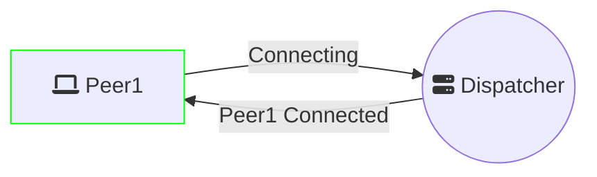
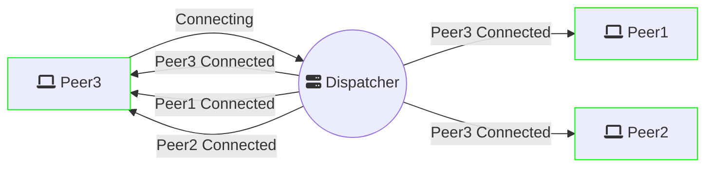
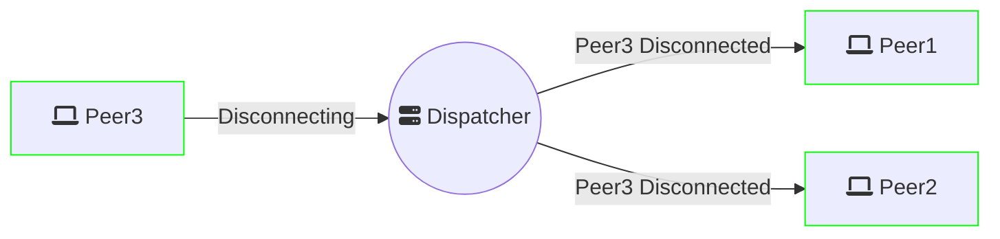
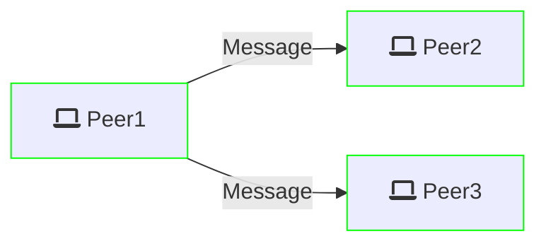

# Documentation of the library

## Dispatcher
Manage connections.

### New connection *Peer1*

### New connection *Peer2*

### New connection *Peer3*

### *Peer3* disconnecting

## Exchange

### *Peer1* Send message to all

