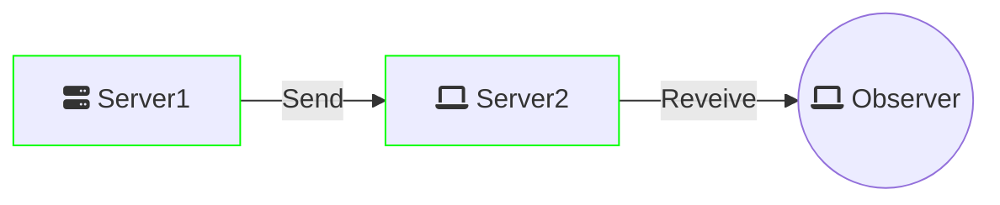

# TESTS


```mermaid
flowchart LR
  classDef server stroke:#0f0;
  
  S1[fa:fa-server Server1]:::server --Send--> S2[fa:fa-server Server2]:::server
  S2[fa:fa-laptop Server2]:::server --Reveive--> O((fa:fa-laptop Observer))
```

```gherkin:features/server/udp.feature

```
